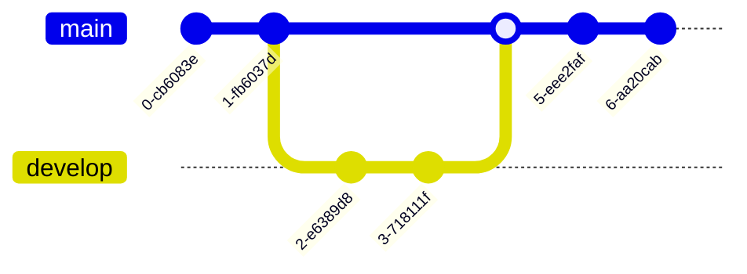

# [AD] Git Gud

Hopefully the last time you have to learn git :)

<!--
Welcome to the git workshop! Before getting started, make sure that everyone has:
 - a laptop, with a unix-like environment (Terminal on macOS, WSL2 on Windows).
 - git installed (run `git --version` to check)
 - a GitHub account (if you don't have one, make one now)
-->

---

# Agenda

 - **What is git?**
 - Why should I care?
 - Cloning, pulling, pushing
 - Branches + the PR workflow
 - Merge conflicts (aah!)
 - Interactive rebase

---

# So what is git, anyway?

 - a *version control system* (VCS)
 - It keeps track of changes over time (eg. allow **undo**)
 - Example: Google Docs (check edit history)
 
---

# So what is git, anyway?

 - As a VCS, it's *decentralized*
 - So every developer has a copy of *everything*.
 - Git provides mechanisms to merge everyone's changes together in the end.

---

# Agenda

 - What is git?
 - **Why should I care?**
 - Cloning, pulling, pushing
 - Branches + the PR workflow
 - Merge conflicts (aah!)
 - Interactive rebase

---

# Let's play a game.

It's called *should have used git*.

I'll give you a scenario. You then say:

**You should have used git!**

... but then you have to tell me why :)

--- 

Picture this: you're my math teacher.
You upload `HW10.pdf`, `HW10REVISED.pdf`, and `hw10revisedREVISED.pdf` to canvas.

*Uh oh! You should have used git!*

<v-click>

> Git would have allowed you to keep track of changes, and revert to a previous version if you made a mistake. So rather than having 3 files, you can have 1 file, with 3 versions.

</v-click>

---

Picture this: you're in 281. Your project is failing the autograder for memory usage, so you make a drastic change and it makes it worse! There's **no undo** :((

*Uh oh! You should have used git!*

<v-click>

> Git would have allowed you to keep track of changes, and revert to a previous version if you made a mistake. So you could **commit** your project before you made the changes, and then **revert** to that commit if your changes failed.

</v-click>

---

Picture this: you've just gotten a new job as an analyst at a bank. Every week, two departments 
send you a new version of their spreadsheets. You have to merge them together, and send it to your
boss.

*Uh oh! You should have used git!*

<v-click>

> Git has an excellent mechanism for merging changes. Each department could have created a **branch** with their changes and git would have been able to **merge** the changes together. No more manual merging!

</v-click>

---

# Agenda

 - What is git?
 - Why should I care?
 - **Cloning, pulling, pushing**
 - Branches + the PR workflow
 - Merge conflicts (aah!)
 - Interactive rebase

---

# Let's get set up

 - Form groups of two people
 - One person shall be `A`, the other `B`.
 - Person `A`, make a new repo on GitHub with a README.
 - Look at me when you're done!
 
---

# Cloning

 - Both people need to **clone** the repo onto your local laptop.
 - You can do this by running `git clone <repo url>`.
 - Look at me when you're done!

---

# Cloning: a diagram

TODO: the rest of this presentation. Here's a git diagram:

---

# Agenda

 - What is git?
 - Why should I care?
 - Cloning, pulling, pushing
 - **Branches + the PR workflow**
 - Merge conflicts (aah!)
 - Interactive rebase

---

# Agenda

 - What is git?
 - Why should I care?
 - Cloning, pulling, pushing
 - Branches + the PR workflow
 - **Merge conflicts (aah!)**
 - Interactive rebase

---

# Agenda

 - What is git?
 - Why should I care?
 - Cloning, pulling, pushing
 - Branches + the PR workflow
 - Merge conflicts (aah!)
 - **Interactive rebase**
